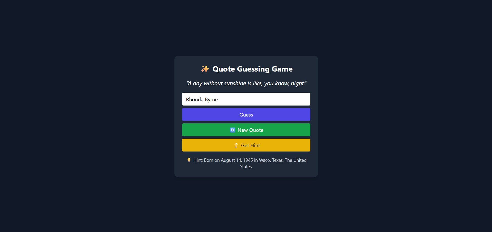

# ✨ Quote Guessing Game

A fun interactive game where players try to guess the author of a random quote.

Built with Flask, BeautifulSoup, and a modern TailwindCSS + JavaScript frontend.

## 🎮 Features

🎲 Fetches random quotes from quotes.toscrape.com

🔍 Guess the author with 4 attempts

💡 Progressive hints:

(1) Author’s birth date & location

(2) First name initial

(3) Last name initial

⚡ Modern, responsive UI (TailwindCSS)

🌐 REST API endpoints (/get_quote, /get_hint)

## 📂 Project Structure

quote-guessing-game/

│── main.py             # Flask backend

│── requirements.txt    # Python dependencies

│

├── templates/

│   └── index.html      # Frontend (UI)

│

├── static/

│   └── app.js          # Frontend logic

│

└── assets/

|   └── ui.png          # UI screenshot(s) for README
    

## ⚙️ Setup & Run

**1️⃣ Clone repo**

git clone https://github.com/your-username/quote-guessing-game.git

cd quote-guessing-game

**2️⃣ Create virtual environment & install dependencies**

python -m venv venv

source venv/bin/activate     # Windows: venv\Scripts\activate

pip install -r requirements.txt

**3️⃣ Start Flask server**

python main.py

**4️⃣ Play the game**

Open in your browser:

👉 http://127.0.0.1:5000

**🖼️ Screenshots**

## 🛠️ Tech Stack

**Backend:** Flask, Requests, BeautifulSoup (web scraping)

**Frontend:** HTML, TailwindCSS, JavaScript (fetch API)

**Data Source:** quotes.toscrape.com
